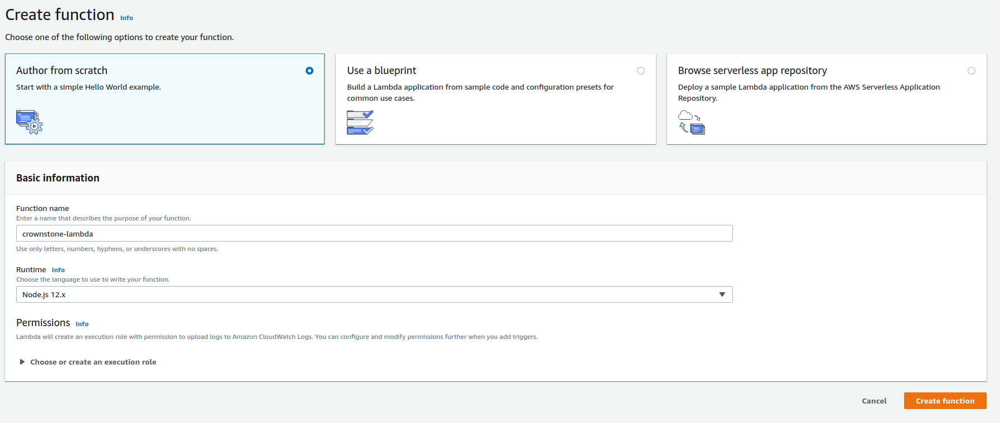
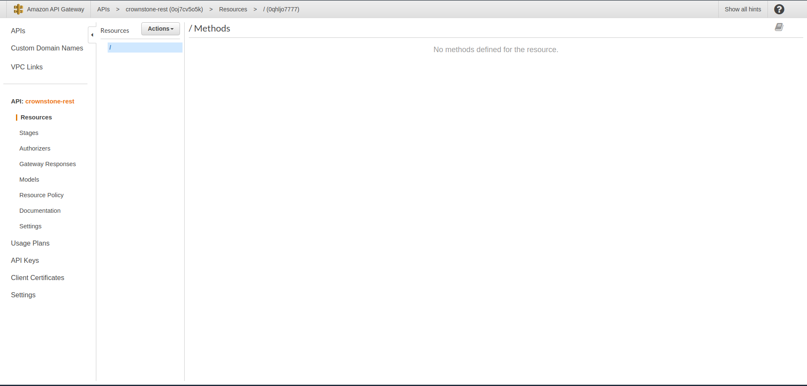
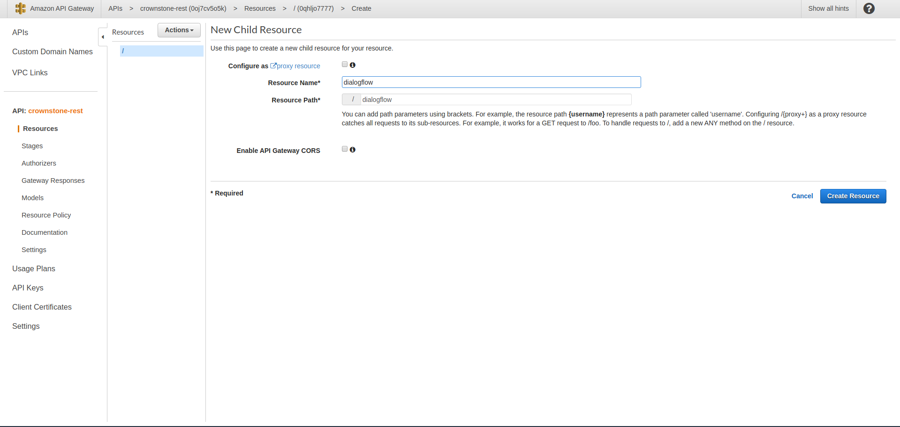
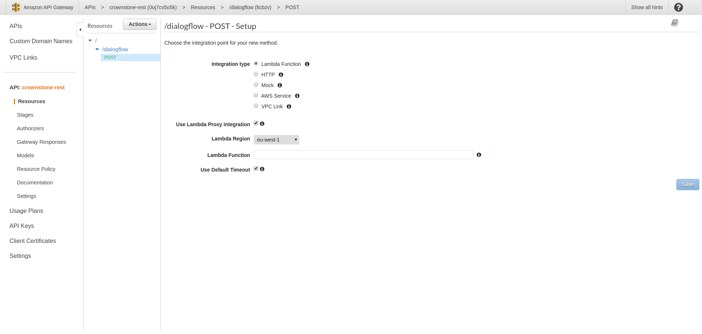
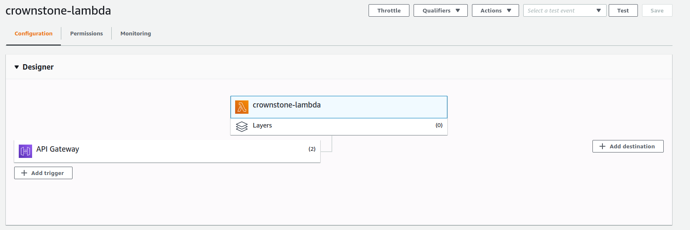

# Crownstone Lambda

> Lambda function for handeling Google Smart Home, Alexa Smart Home skill and Dialogflow intents

## Table of Contents (Optional)

-   [Installation](#installation)
-   [Features](#features)
-   [Documenation](#documentation)
-   [Copyrights](#copyrights)

---

## Installation

First clone this repository and install the npm packages by running

```shell
$ yarn install
```

or

```shell
npm install
```

To host the lambda function we must meet the following requirements:

-   AWS account
-   Google Account
-   Google service key
-   Event server URL
-   Event server JWT

#### Homegraph

The lambda function depends on the package `actions-on-google`, this package handles the Google Smart Home and Dialogflow intents. This package requires a google service key, this key is used to access the Homegraph database.

Follow these steps to retreive a service key:

1. If you havent already done so, create a Google account,
2. signin to the Google console, and select/create a project.
3. Search for Homegraph in the navbar, and enable it. <b>make sure you enable it on the correct project!</b>.
4. In the side nav bar, select the Service Accounts link under IAM & Admin, then click create service account.
5. fill in the service account name and id, in the role list select the <b>Service Accounts > Service Account Token Creator</b>.
6. After creating the service account, select the accoount and click <b>Add Key > Create new key</b> choose as output type JSON.
7. Rename your key to google_service_key.json and place it in the "private" folder. the code in `src/utils/config.ts` expects the file to be named this way, this can be changed.

We can now upload the code to AWS Lambda, since the code is written in typescript, it should be first compiled to JS. Run the following command in the root of the project.

```shell
$ npm run build
```

or

```shell
yarn build
```

This command will compile the code to JS, these files can be found in the folder build after typescript is done compiling. The command will also create a zip, ready to deploy on AWS Lambda.

#### AWS Lambda

You can now upload the lambda code through the AWS lambda console.
Follow these steps to configure AWS Lambda:

1. If you havent already done so, create a AWS account.
2. signin to the AWS managment console, and select your region in the top right corner. If you are hosting the code in Europe, you should select eu-west-1. this region supports alexa smart home skill.
3. Select the Lambda, and click create function in the top right corner. AWS Lambda requires the runtime and name to create the Lambda. Choose Nodejs 12.x for the runtime.
   
   4.You should now see the lambda overview, we can configure our lambda function here. In the top right corner of the "Function code" tab click on actions, select upload a .zip file and upload the function.zip.
4. In the "Environment variables" panel, we can set the `EVENT_SERVER_JWT` AND `EVENT_SERVER_URL` variables. Go to the [event-server readme](https://github.com/oscaroox/crownstone-event-listener) for these values.

The code is now deployed to AWS Lambda. APIGateway should now be configured to route HTTP requests from Google to this lambda function.

1. search for api gateway in the search bar and click on "Create API" in the topright corner. Choose REST API and click build.
2. Insert the api name, description and region, the next screen should be the overview of the api.
   
3. Click actions and add a new resource, the resource name should be "/dialogflow" and "/smarthome", these paths will be used for the dialogflow and google smart home fullfillment. Click create resource to continue.
   
4. In the resources view there should be a new path called "dialogflow".Click on the path and in the Actions dropdown select "Create method", choose the method POST.
   
   5.For integration type pick "Lambda Function", check the option "Use Lambda proxy integration" this is important because we check the url path in the lambda entrypoint, without this option dialogflow will only send the data without context.
5. Select the lamnda function and click save.
6. Repeat steps 3 to 5 for the "smarthome" resource.
7. Deploy the api by clicking "Deploy API" in the actions dropdown.
8. The lambda function overview should now have the API Gateway api in the list of triggers.
   
9. Click on the API Gateway trigger, there should be a list with urls for the resources created, these will be used for smart home and dialogflow fullfillment.

#### Google Smart Home

1. Go to the [Action console](https://console.actions.google.com/)
2. Create a new project, make sure this action is created in the same project where Homegraph is enabled.
3. Choose Smart Home.
4. Insert a invocation name.
5. In the Actions tab insert the fullfillment url for the "/smarthome" resource found in the lambda function.
6. Configure account linking with your client id and secret.
7. Add the scopes of the token, the Documenation section should have a list with API calls used from the Crownstone Cloud.
8. After configuring through the webtool, you should be able to install the Action through Google Home on your android phone.

#### Dialogflow

For Dialogflow we will also create a new Action in the actions console, but this time we will have to import the intents found in the zip file in the assets folder.

1. Go to the [Action console](https://console.actions.google.com/)
2. Create a new project.
3. Select "Custom", The next page scroll to the bottom and select "Click here to build your Action using DialogFlow". It seems that Google has a new way of creating conversational Action.
4. Click Develop > Actions > Create action and Custom intent.
5. In the dialogflow console click "Create" in the top right corner.
6. Click the small "cog" icon then the Export and Import tab.
7. Click import from zip and upload the assets/Crownstone-dialog.zip file.
8. In the sidebar click fullfillment and insert the "/dialogflow" url from the Lambda function.
9. Click save

#### Alexa smart home skill

Configuring the Alexa smart home skill, is almost the same as for google.

1. Go to the [Alexa skill console](https://developer.amazon.com/alexa/console/ask).
2. Create a new skill, and pick the smart home model.
3. Choose provision your own to host the skill backend.
4. In the next page there should be the skill id. copy this and head over the lambda function overview.
5. Click "Add trigger" and choose "Alexa smart home".
6. Insert the skill application id.
7. Copy the lambda arn found in the top right corner, and insert this in the skill.
8. Setup account linking.

---

## Features

This project supports the following features:

-   Google Smart Home
-   Dialogflow custom conversations
-   Alexa Smart Home
-   I18N support

The Dialogflow feature supports the following questions:

-   "Is anyone home?"
-   "Is X home?"

There are a few questions missing in the dialogflow implemenation.
For example "Why are the lights on?". this question was possible to design in the dialogflow console, but i couldn't get the data needed for this question. The following questions are designed but not activated in the console:

-   "why is the X on?"
-   "Why is the X off?"
-   "why did the 'DEVICE-X' go on in the 'ROOM-X'"
-   "why did the 'DEVICE-X' go off in the 'ROOM-X'"

The Dialogflow implementation also supports dutch and english. The smart home implementations automatically support these languages and more.

Alexa can also support the dialogflow conversations, it is possible to import the `assets/Crownstone-dialog.zip` into a Alexa Custom Skill. This feature hasnt been implemented yet.

## Documentation

At the core of this application is a single entrypoint which handles incomming requests from Google and Amazon. The entrypoint can be found in the file `src/index.ts`. This function calls one of the handlers defined in `src/google/index.ts` and `src/alexa/index.ts`.

The file `src/google/smarthome.ts` contains the code for Google smart home intents, `src/google/dialogflow` contains code for the dialogflow converstations.

The file `src/alexa/smarthome.ts` contains code for the Alexa smart home skill, and the file `src/alexa/customskill.ts` contains code for the Dialogflow conversations. This feature hasnt been implemented yet.

#### Typescript typings

The typings for the `aws-lambda` package is incomplete as of this writing. In the `src/amazon.interface.ts` are typings i created by looking at the response from APIGateway. These typings may be obsolete in the near feature.

#### I18N

This project supports internationalization, in the `src/locales` folder are the en and nl translations for the Dialogflow intents, used in `src/google/dialogflow.ts`. The package used for this feature is "i18next".

These translations can also be used for the Alexa Custom Skill implementation.
In the `src/google/index.ts` the function `await initI18N();` this function call can be moved to the lambda entrypoint if the Alexa Custom skill is implemented.

#### Crownston Cloud used endpoints

Account linking requires a client id and client secret from crownstone, it also requires the scope of the tokens requested.
For the scope i used "all". This scope probably is not the best for production usage. The following list contains all the api endpoints used, its for the best to determine the scopes required for these endpoints.

-   GET /Stones
-   GET /Stones/:id/owner
-   PUT /Stones/:id/setSwitchStateRemotely
-   GET /Stones/:id/currentSwitchState
-   GET /users/me
-   GET /users/:id/currentLocation
-   GET /Spheres/:id/users
-   GET /Spheres/:id/presentPeople

---

## Copyrights

Copyrights belong to Crownstone and are provided under a noncontagious open-source license:

    Authors: Oscar Druiventak
    Creation date: 28 Jun, 2020
    Licensed: MIT
    Crownstone: https://crownstone.rocks
    Stationsplein 45 d1.118, 3013 AK Rotterdam, The Netherlands
